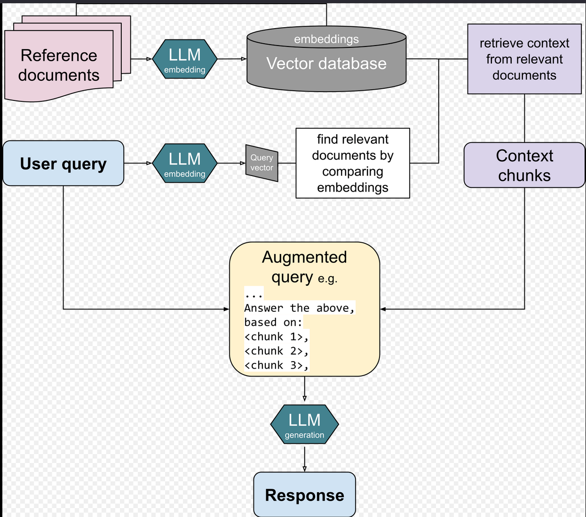

# Retrieval-Augmented Generation
## 1. Vulgarisation du concept
Un LLM classique (comme Llama3 ou Gemma) est comme un étudiant brillant qui a passé un examen en apprenant par cœur des milliards de livres jusqu'à sa date d'entraînement. Si on lui demande de coder avec une syntaxe très spécifique du livre de Ruby ou de parler des notes de cours de robotique de Nicolas, ou encore des cours à James, il ne les connaît pas. N'aimant pas dire "je ne sais pas", il va inventer des réponses plausibles : c'est l'hallucination.

Le *RAG (Retrieval-Augmented Generation)* transforme mon LLM en cet étudiant, mais avec un droit d'accès à livre ouvert.

* **Retrieval (Récupération) :**  Quand tu poses une question, le système va fouiller instantanément dans les documents locaux pour y trouver les 3 ou 4 paragraphes les plus pertinents.
* **Augmented (Augmenté) :**  Le système prend la question initiale et y "colle" ces paragraphes trouvés pour créer un super-prompt.
* **Generation (Génération) :** Le LLM lit ce super-prompt et génère une réponse. Comme la réponse exacte est sous ses yeux, le risque d'hallucination tombe pratiquement à zéro.

## 2. Notions clés: La solution Open WebUI vs Le code à la main 
Si on devait coder ce pipeline nous-même ("à la dure"), voici ce qu'on ferait, et comment Open WebUIsimplifie la vie :
### Les Embeddings : La traduction sémantique
- **Le concept :** Un LLM ne comprend pas les mots, il comprend les mathématiques. Un embedding est un algorithme (un modèle dédié) qui prend une phrase et la transforme en une liste de nombres (un vecteur). Ce vecteur représente le sens de la phrase dans un espace géométrique multidimensionnel. Par exemple, les phrases "Comment configurer nginx en reverse proxy?" et "Procédure pour rediriger le traffic HTTP vers un conteneur" auront des coordonnées mathématiques très proches, car elles partagent le même sens, même si aucun mot n'est identique. 
- **À la main :** Il faurait charger un modèle d'embedding (via HuggingFace ou une route Ollama), lui envoyer le texte par morceaux *(chunks)*, et récupérer le tableau de float en JSON.
- **Dans Open WebUI :** Dès qu'on téléverses un fichier, il appelle un modèle d'embedding interne (souvent une version miniature locale) ou Ollama pour vectoriser chaque phrase automatiquement.

### Vector DB (ChromaDB) : Le stockage géométrique
- **Le concept :** Une base de données relationnelle classique (comme ta MariaDB ou SQLite3) cherche par mots-clés exacts (WHERE text LIKE '%mcp%'). Une base de données vectorielle stocke les coordonnées mathématiques (les embeddings). Quand on pose une question, elle calcule la distance géométrique (souvent via la similarité cosinus) entre le vecteur de la question et les vecteurs des documents. Elle retourne les segments textuels les plus proches géométriquement.
- **À la main :** Il aurait fallu installer la bibliothèque `chromadb` ou un conteneur dédié, créer une collection, y insérer tes vecteurs manuellement avec leurs ID, et écrire une fonction `collection.query(query_embeddings=[...], n_results=3)`.
- **Dans Open WebUI :** Open WebUI embarque une instance de ChromaDB en tâche de fond dans son conteneur. Ce qui fait qu'on a aucune table à créer, il s'occupe de l'indexation et de la recherche de similarité tout seul dès qu'on lance un chat avec un document attaché.

### Context Window & System Prompt : La mémoire de travail
- **Le concept :** La Fenêtre de contexte est la mémoire à court terme du LLM. C'est la quantité maximale de texte (tokens) que le modèle peut traiter en une seule fois (la question + les documents trouvés + l'historique du chat). Si le contexte déborde, le modèle "oublie" le début de la conversation. Alors que, le System Prompt est le guardrail, la directive absolue. C'est l'encadrement qui dit au modèle comment se comporter avec les documents reçus.
- **À la main :** Il faudrait concaténer les textes récupérés de ChromaDB à l'intérieur d'un template de chaîne de caractères, calculer le nombre de tokens pour s'assurer que ça rentre dans les limites du modèle (ex: 8k pour Llama3), et l'envoyer à l'API d'Ollama.
- **Dans Open WebUI :** Il injecte un System Prompt invisible pour encapsuler le RAG, qui ressemble souvent à ceci : "Tu es un assistant virtuel. Utilise uniquement les extraits de documents suivants pour répondre à la question de l'utilisateur. Si tu ne trouves pas la réponse, dis que tu ne sais pas." Il gère aussi dynamiquement la taille de la fenêtre en limitant le nombre de morceaux de texte (num_ctx) qu'il extrait de ChromaDB.

### Base de connaissances vs Injection Éphémère
- **Le concept :** Il existe une différence d'architecture majeure entre la création d'une base de connaissances réutilisable et le téléversement ponctuel de fichiers au cours d'une discussion.
- **Injection éphémère (In-Context Stuffing) :** Lorsqu'on glisse-dépose ou téléverse un script de déploiement ou un fichier de configuration directement dans l'invite de commande d'une discussion active (comme sur Gemini, ChatGPT ou un chat vierge d'Open WebUI), le système lit l'intégralité du texte brut et la "colle" directement au début de la mémoire de travail courante. Cette information fait partie de l'historique de ce chat précis et s'efface définitivement dès que la discussion est supprimée. C'est idéal pour un débogage rapide de logs, mais cela sature rapidement la fenêtre de contexte si le fichier est volumineux.
- **Mode Base de connaissances :** À l'inverse, l'importation de fichiers dans l'onglet "Documents" d'Open WebUI crée une persistance indexée. Le fichier subit le traitement RAG complet : il est découpé, converti en embeddings et stocké de manière permanente dans ChromaDB. Le document complet n'est jamais envoyé tel quel au LLM. À la place, lorsque l'utilisateur pose une question dans n'importe quelle session de chat future, l'interface interroge ChromaDB en tâche de fond pour en extraire chirurgicalement les fragments pertinents. Ce mode permet à l'infrastructure d'absorber des gigaoctets de manuels de serveurs et de politiques réseau sans jamais alourdir la mémoire vive du modèle.

### Visualisation 

<table>
    <tr>
        <td style="text-align: center; padding: 10px;">
            
            <figcaption>Figure 2 : Principe de fonctionnement du mécanisme RAG et simulation intégration Open WebUI</figcaption>
        </td>
        <td style="text-align: center; padding: 10px;">
            
            <figcaption>Figure 3 : Flux technique détaillé traitement des requêtes et RAG</figcaption>
        </td>
    </tr>
</table>
